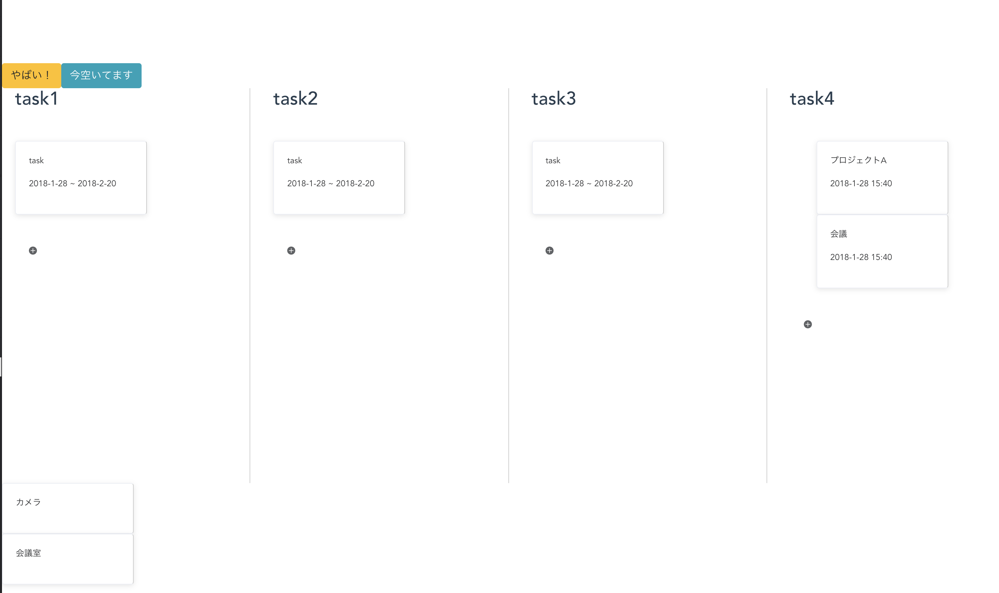

# future_lab_hackathon

## SetUp
```bash
# ./web
npm run dev

# ./server
node server.js
```

## web


タスク管理ツールです。

ドラッグ&ドロップでタスクの管理ができます。

タスク(物)をカードとして扱うことで、全体で共有している物の状況がわかります。

+ボタンを押してタスクを追加、或いは下部にある予め用意しておいたカードを任意の場所へ追加できます。

ページ上部にある[やばい] [今空いている]ボタンで、他のメンバーに通知を飛ばすことができます。

### 未実装部分
- ドラッグ&ドロップの機能
- 日付の管理
- 通知の機能
- データベースとの連携等..

## server
socketを使って通知の管理をする予定だったのですが、途中で他の物を使うことになり、破棄することになりました。

socketだと、常に同期を取り続けないといけないため、Google Cloud Messaging APIを使用することになりました。
